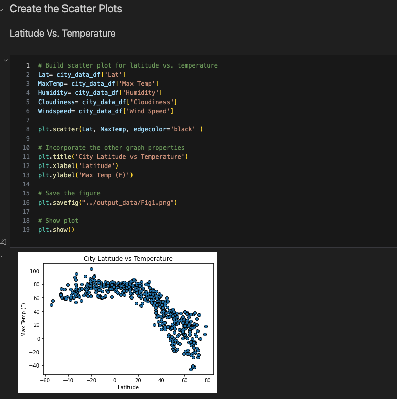
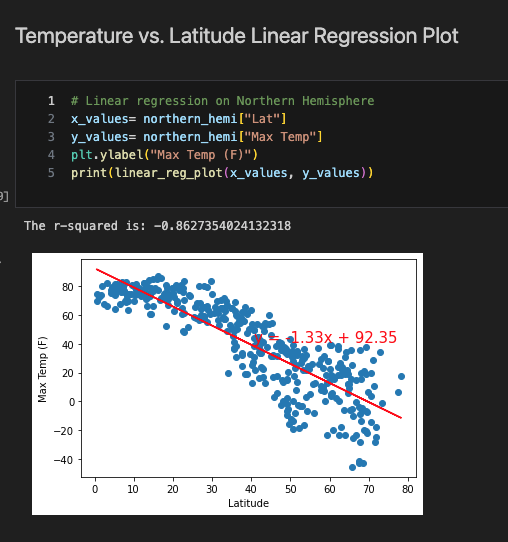

# python-api-challenge

---

*Purpose:*  
*Step One:*  
*Generate Random City Weather and Coordinate Data*  
*Create scatter plots and linear regressions comparing Northern and Southern Hemispheres*  
*Scatter Plot Comparisons Include:*  
*- Latitude vs Temp*  
*- Latitude vs Humidity*  
*- Latitude vs Cloudiness*  
*- Latitude vs Wind Speed*  

*Step Two:*  
*Use resulting data to determine best COLD vacation spot (because beaches are overrated) using specific criteria.*  

---
# Step One  
## Generate Random City List and Coordinates
Using citipy Library, generated a list of 626 cities

---

## Use OpenWeatherMap API to retrieve weather data from list
Created empty list to hold all gathered weather data. Weather data includes:
-Latittude
-Longitude
-Temperature
-Humdidity
-Wind Speed
-Country
-Date/time
-Cloud cover

---

## Display sample data and export to csv files
Checked to make sure correct data gathered

---

## Comparing Scatter Plots and finding Linear Regressions
*Latitude vs Temp*  
  

*Latitude vs Humidity*  
  

*Latitude vs Cloudiness*  
  

*Latitude vs Wind Speed*  
  

---

## Finding the linear regression for Northern and Southern Hemispheres
Split the data into Northern and Southern hemispheres to better understand weather trends.  

*Temperature vs Latitude: Northern hemisphere:*
  

*Temperature vs Latitude: Southern hemisphere:*
  

**Discussion regarding temp vs lat in the N/S hemispheres:**  
For the northern hemisphere the closer to the north pole (i.e. higher the latitude) the max temp drops. 
Alternatively, for the south pole the closer to the south pole (i.e. lower in latitude) the max temp drops. 
Essentially, the closer to a latitude of zero, in southern or northern hemisphere, the higher the temp.  

*Humidity vs Latitude: Northern hemisphere:*  
  

*Humidity vs Latitude: Southern hemisphere:*  
 

**Discussion regarding humidity vs lat in the N/S hemispheres:**  
My original assumption was that the closer to a latitude of zero in northern and southern hemispheres would yield a higher average humidty. According to this data the closer you get to the north pole the higher the humidity.
To be sure, there are several points on the northern hemisphere between the latitudes of 10-50 that may be altering the r-value in the norhern hemisphere data. 
At any rate, the humidity seems to be primarily up north. Not what I was expecting.

---

# Step Two
## Plot all the cities generated  
Using the data from Step One plot an ideal vacation spot  

---

## Plot all the generated cities onto a map. 
*The size of the plot point over the city is dictated by the amount of humidity (i.e. the more humidity the bigger the point)*  
  

---

## Find prime vacation spot
*Using the following criteria, find the ideal COLD weather vacation spot.*  
| Max Temp | Humidity | Wind Speed |
|----------|----------|------------|
| < = 40 F | < = 75 g/kg | < = 7  mph |

*The hope is the temperature, humidity, and wind speed are ideal for snowfall and thereore snowboarding activities*
  

---

## Search for hotels amongst prime vacation locations
*For each city that meets the above criteria, use Geoapify API to find the first hotel within 10k meters of coordinates*  
  
  

*Create a hotel dataframe using the results from above*  
  

---

## Map the prime vacation spots by hotel
*Now that we have the prime cold vacation spots and the closest hotel to the coordinates, it's time to map our destination vacation*  
  

